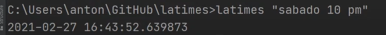

# Proyecto Final, PYTHON BÁSICO

## Objetivos de aprendizaje
- Aplicar nuevas habilidades a un problema del mundo real
- Sintetizar las técnicas aprendidas

## Herramientas
- git
- github
- python
- poetry
- pandas
- numpy
- click

> TODO: Actualizar la lista de herramientas si utilizo algún librería adicional.

## Organización de carpetas
> TODO: Actualizar, revisar uso de comando [tree](https://stackoverflow.com/questions/23989232/is-there-a-way-to-represent-a-directory-tree-in-a-github-readme-md) y [documento](https://github.com/kriasoft/Folder-Structure-Conventions/blob/master/README.md) de referencia


```
poetry-demo
├── pyproject.toml              
├── README.md                   # Documentación del proyecto    
├── poetry_demo
│   └── __init__.py
└── tests
    ├── __init__.py
    └── test_poetry_demo.py
```
> TODO: Actualizar la lista de archivos.

## Descripción
> TODO: Actualizar

SMARTSEC Node es una aplicación desarrollada en Python que procesa información
de audio y vídeo para realizar el reconocimiento de asaltos con armas de fuego en tiempo real. Cuando un asalto es detectado, se genera una foto del momento y una grabación de vídeo de 10 segundos, 5 segundos antes y 5 después de la detección. Mediante Wi-Fi, se envía la información de la imagen, vídeo y fecha hacia la plataforma SMARTSEC Monitor.

### Fuente de datos
> TODO: Detallar la fuente de datos sólo en el caso que su aplicación utilice datos externos. Agregar URLs.

A continuación se muestra el funcionamiento de la aplicación. 

> TODO: Actualizar captura y enlace  a video en youtube
<div align="center">
<a href="https://youtu.be/nNfgWhCqk4w?list=PL6cBnnS2SIgr6u1_qau_d3JAC0mI98uqd&t=6941" target="_blank">

</a>
<p>Demostración de funcionamiento</p>
</div>

<br/><br/>


## Versiones y evoluciones del producto
> TODO: Completar

Versión 1.0 Junio 2022

- Cálculo de datos estadísticos
- Lectura de opciones desde terminal de comandos. 
- ....  
